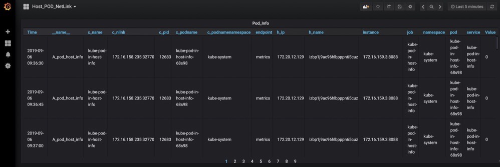

# Host-Pod-Metrics



## 🍬 Features

- Get pod pid
- Get pod netlink
- Support Prometheus

## 🚀 Installation

### Prerequisites

- Prometheus operator
- Grafana
  
### Getting Started

- Install the kubernetes:
  
    ```bash
    kubectl apply -f  DaemonSet.yml
    ```

- Input Grafana table
  
  Home -->  Import dashboard -->  Host_POD_NetLink.json 

